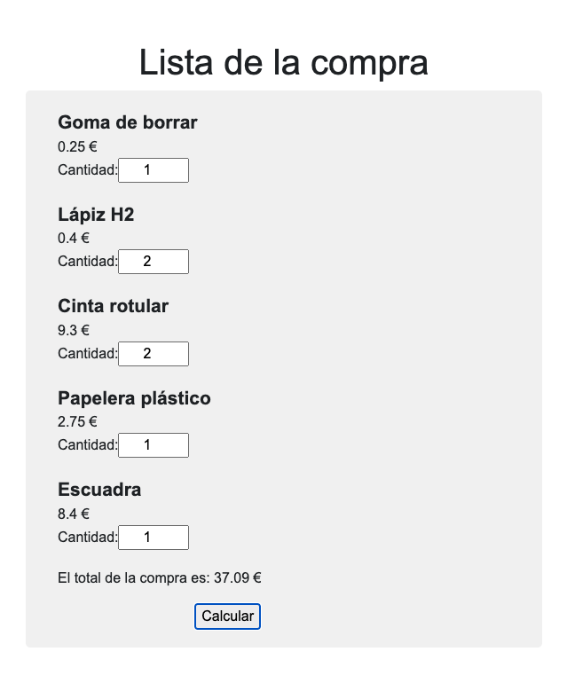

# Lemoncode-module-6.1-cart

In this javascript exercise there is a list of products created with dynamic html.

The products have description, price, tax and stock. 

For each product an input is created to choose the quantity you want to buy.

Finally there is a button to calculate the total price of the purchase.

